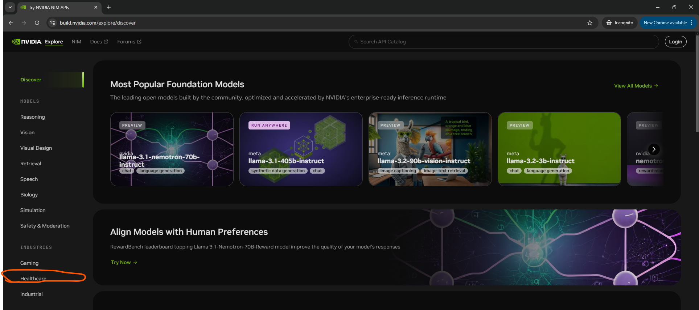
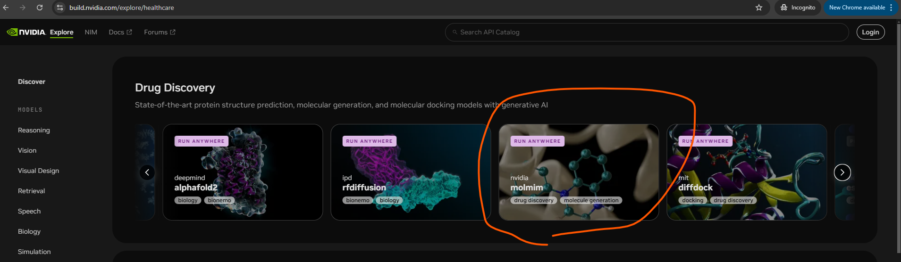
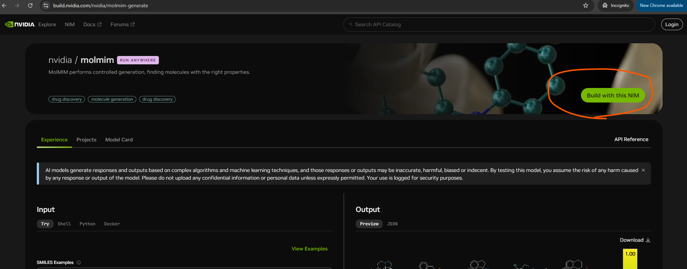
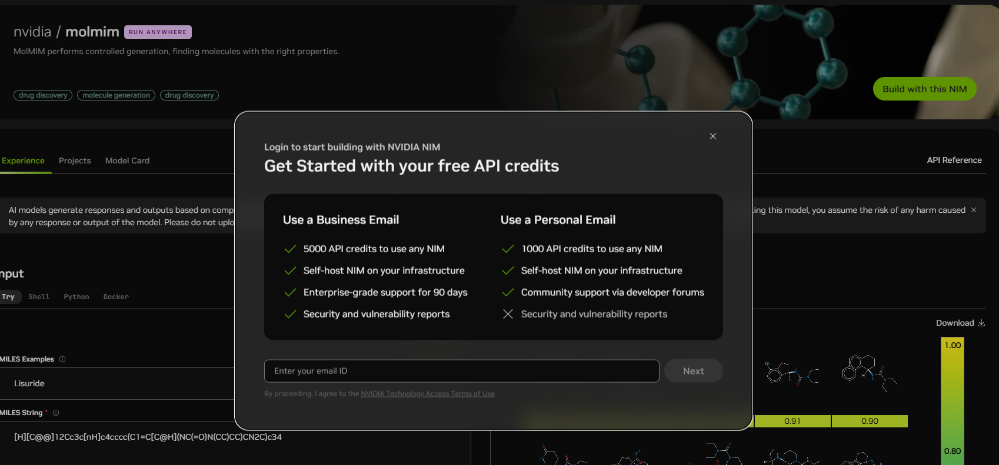
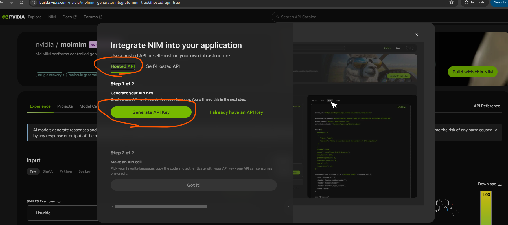
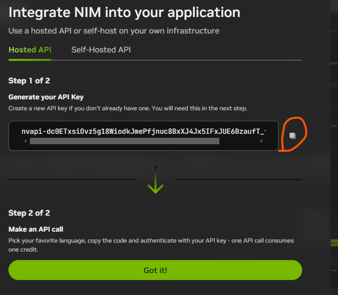
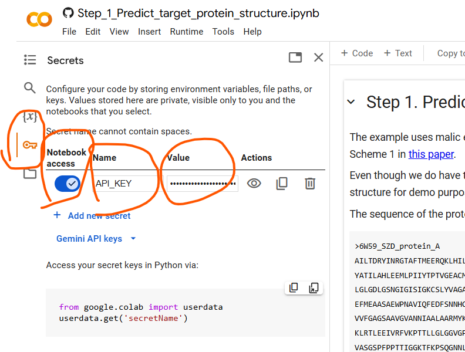

# Tutorial - using NVIDIA-hosted BioNeMo NIMs for virtual screening
This tutorial uses NVIDA-hosted BioNeMo NIMs running on NVIDIA's computing infrastructure. In order to use them, user needs to generate API KEY from build.nvidia.com and then copy & paste it to Colab. After that, user can run the three tutorial Jupyter Notebooks one-by-one. Please follow the instructions below.
### 1. Set up API KEY
- Go to [build.nvidia.com](https://build.nvidia.com/explore/discover) in your web browser.
- Click "Healthcare" in the left-hand menu (highlighted with an orange stroke below):

- Click "molmim" (highlighted with an orange stroke below):

- Click "Build with this NIM" in the top right corner (highlighted with an orange stroke below):

- In the pop-up window, enter your email address to receive free credits for using NVIDIA-hosted NIMs, then click "Next":  

- Follow the instructions to either log in or create a free NVIDIA Developer account.
- You might need to click on "Build with this NIM" again, under "Hosted API" click "Generate API Key" in the pop-up window (highlighted with orange strokes below):  

- Your API Key shows up, click the button next to it to copy it (highlighted with an orange stroke below):

- Click "Open in Colab" next to `Step_1_Predict_target_protein_structure.ipynb` in [2. Run Jupyter Notebooks](#2._Run_Jupyter_Notebooks) to open it in Colab.
- Click key button in the left-hand menu, turn on "Notebook access", put "API_KEY" under "Name", and paste the API Key under "Value" (highlighted with orange strokes below):  

- Now you're ready to run the three Jupyter notebooks one-by-one.

### 2. Run Jupyter Notebooks
Step_1_Predict_target_protein_structure.ipynb 

Step_2_MolMIM_controlled_generation.ipynb 

Step_3_Predict_docking_poses.ipynb 

